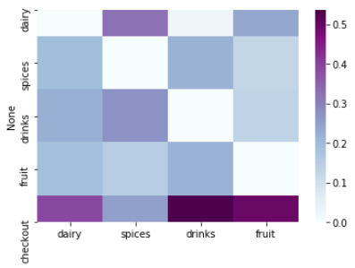
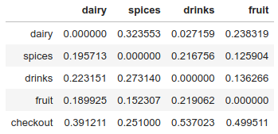

# Supermarket

The data used correspond to fictional customers in a supermarket. Each row specifies the location of each customer in the supermarket (aisles, entrance, checkout) and a timestamp during a 5 days week (Monday-Friday).

From the data I build a probability matrix that shows the probability of a random customer of going from each one of the possibles locations in the supermarket to any other.

  

Using the probabilities of the matrix, I simulated customer behaviors and created a visualization that shows how is that customer moving around the supermarket.

To use it just clone the repository and run simulation.py
